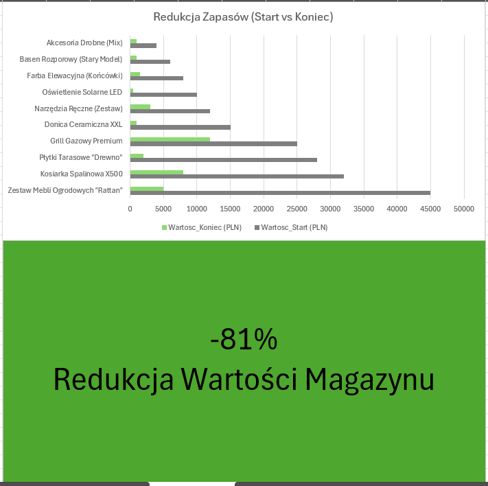

#  Narzędzie Optymalizacji Zapasów (Excel)

### [Pobierz Narzędzie Excel](Inventory_Optimization_Tool.xlsx) | [Pobierz Case Study PDF](Case_Study.pdf)

Projekt praktyczny zrealizowany w branży retail. Stworzyłem narzędzie oparte na Excelu, które pozwoliło zidentyfikować i zredukować towary trudnozbywalne (Aging Stock).

###  Wyniki Biznesowe:
*   **Redukcja Zapasów:** Zmniejszenie wartości magazynu o **81%** (z 185 tys. do 35 tys. PLN).
*   **Cash Flow:** Uwolnienie **150 000 PLN** zamrożonego kapitału.
*   **Narzędzie:** Zautomatyzowana lista priorytetów sprzedażowych dla zespołu handlowego (Formatowanie warunkowe, Logika IF).

###  Wykorzystane Funkcje Excel:
*   **Logika Biznesowa:** Funkcje `IF`, `VLOOKUP`.
*   **Wizualizacja:** Dashboard wyników, Formatowanie Warunkowe (Traffic Lights).
*   **Oczyszczanie Danych:** Przygotowanie bazy pod analizę.
